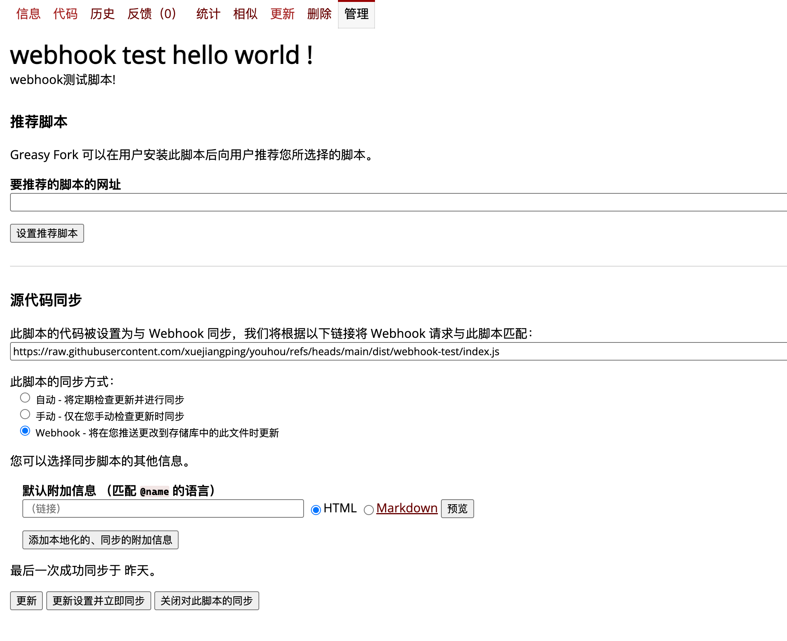

# Youhou 油猴脚本项目

这是一个使用 Vite 构建油猴脚本和公共工具包的项目。

## 环境准备

```bash
pnpm install
```

## 项目结构

```text
src/
├── scripts/
│   ├── watch-input/
│   │   ├── index.js          # 油猴脚本入口和 UserScript 元数据
│   │   └── features/         # watch-input 的具体功能
│   └── webhook-test/
│       ├── index.js          # 油猴脚本入口和 UserScript 元数据
│       └── features/         # webhook-test 的具体功能
├── utils/                    # 可复用的公共工具
│   ├── GamepadController.js
│   ├── sayHello.js
│   └── index.js
└── a/
    └── b/                    # 其他测试脚本
```

每个油猴脚本都应该有独立的目录和 `index.js` 入口。入口文件顶部保留 Tampermonkey 元数据，例如 `// ==UserScript==`、`@match`、`@grant` 和 `@require`。具体业务放在 `features`、`services` 或 `ui` 目录中；多个脚本共用的无副作用代码放到 `utils` 或 `shared` 中。

## 构建命令

```bash
# 构建公共 YHUtils 工具包
pnpm build:utils

# 构建 watch-input 等 @require 脚本，使用压缩配置
pnpm build:yhscript

# 构建当前 raw 配置指定的油猴脚本，不压缩
pnpm build:yhscript:raw

# 监听脚本变化并持续构建
pnpm watch:yhscript
```

构建产物位于 `dist/<脚本名>/index.js`。当前 raw 构建输出为 IIFE，能够把依赖和业务代码放进同一个立即执行函数，避免顶层变量污染页面或其他脚本。

## 切换 raw 构建脚本

编辑 `vite.config.yhscript.raw.js`，只需要修改这两个变量：

```js
const dirName = 'watch-input'
// const dirName = 'webhook-test'

const entry = `src/scripts/${dirName}/index.js`
const outDir = `dist/${dirName}`
```

例如构建 `webhook-test` 时：

```js
const dirName = 'webhook-test'
// const dirName = 'watch-input'
```

然后执行：

```bash
pnpm build:yhscript:raw
```

## raw 构建特点

`vite.config.yhscript.raw.js` 用于需要保留油猴元注释信息的源码可读性的油猴脚本：

- `minify: false`：不压缩代码
- `treeshake: false`：不主动删除未使用代码
- `formats: ['iife']`：将脚本和依赖包在 IIFE 中
- 构建后自动恢复 UserScript 元数据
- `emptyOutDir: false`：不清空整个输出目录，只更新生成的同名文件
- 自动删除或修改代码之外的内容不会影响油猴元数据

## 公共工具包和 `@require`

先构建公共工具包：

```bash
pnpm build:utils
```

然后在油猴入口中使用 `@require`：

```js
// @require      https://xuejiangping.github.io/youhou/dist/utils/yh-utils.umd.cjs
```

使用 `@grant GM_xmlhttpRequest` 时，确保公共工具包或脚本运行环境已经提供对应的油猴 API。

## 通过 Greasy Fork 同步脚本

以 `webhook-test` 为例，先构建 raw 脚本：

```bash
# 编辑 vite.config.yhscript.raw.js，将 dirName 设置为 webhook-test
pnpm build:yhscript:raw
```

构建完成后，将 `dist/webhook-test/index.js` 推送到 GitHub 的 `main` 分支。该文件的 raw 地址为：

```text
https://raw.githubusercontent.com/xuejiangping/youhou/main/dist/webhook-test/index.js
```

在 Greasy Fork 的脚本管理页面中：

1. 打开“代码同步”或“源代码同步”设置。
2. 将上面的 raw 地址粘贴到脚本代码来源 URL。
3. 首次配置时选择“手动”同步并执行一次同步，确认脚本名称、版本和 UserScript 元数据显示正确。
4. 确认无误后，将同步方式改为“自动”或“Webhook”。

每次发布前都应先构建，再提交并推送产物：

```bash
pnpm build:yhscript:raw
git add dist/webhook-test/index.js
git commit -m "build webhook-test"
git push origin main
```

## Webhook 自动同步示例

选择 Greasy Fork 的“Webhook”同步方式后，按照页面显示的 Webhook 地址配置 GitHub 仓库：

1. 打开 GitHub 仓库的 `Settings > Webhooks`，点击 `Add webhook`。
2. 将 Greasy Fork 提供的 Webhook 地址填入 `Payload URL`。
3. `Content type` 选择 `application/json`，事件选择仅推送 `Push events`。
4. 如果 Greasy Fork 页面提供了 Secret，将同一个 Secret 填入 GitHub；否则保持默认设置。
5. 保存后向 `main` 分支推送 `dist/webhook-test/index.js`，再回到 Greasy Fork 查看同步结果。

Webhook 只负责触发 Greasy Fork 检查代码，脚本内容仍然来自上面的 raw 地址。因此仓库中的文件路径、分支和 Greasy Fork 配置必须保持一致。可以先在 GitHub 的 Webhook 页面使用 `Recent Deliveries` 检查请求是否成功，再在 Greasy Fork 管理页面确认版本已更新。

### Greasy Fork 配置截图



## 部署命令

以下命令会构建、提交并推送 Git 变更，请确认远程仓库和 Git 状态后再执行：

```bash
pnpm deploy:utils
pnpm deploy:yhscript
pnpm deploy:yhscript:raw
```
